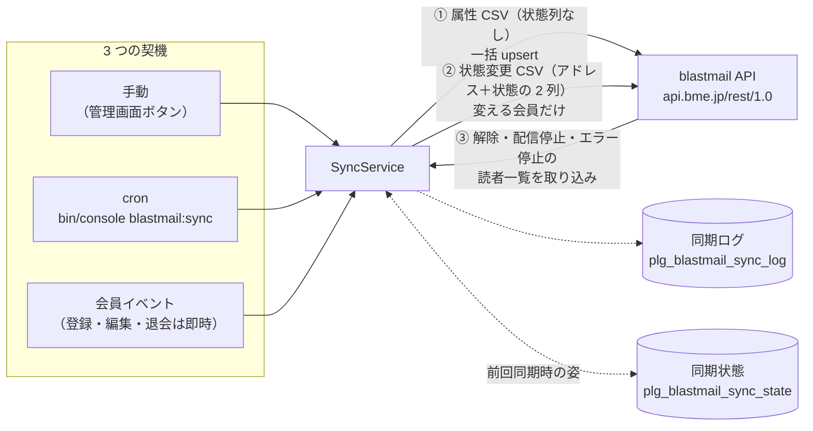
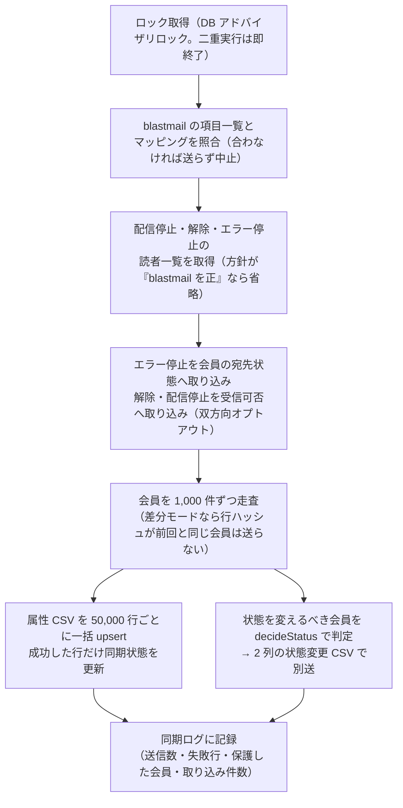
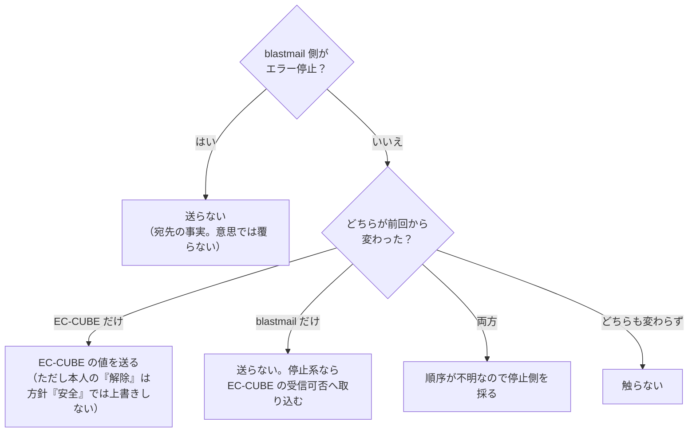

# BlastmailSync 設計資料

どういう作りで、何を気を付けて作っているかをまとめる。**急いで読むなら、図 3 つと「気を付けていること」の表だけで全体がつかめる。**

- 使い方・項目一覧・決定表の全文: [README.md](README.md)
- 正はこのディレクトリのコード（2026-09-28 に通読して記述）。本文とコードが食い違ったらコードが正で、この文書を直す

## 一言でいうと

**EC-CUBE の会員台帳を blastmail の読者名簿へ写し続けるプラグイン。** 属性（誰か・何を買ったか）は堂々と上書きし、状態（配信中・解除など＝本人の意思）は慎重に扱う。この 2 つを**別の CSV に分けて送る**のが作りの根幹。

- ①だけなら読者の状態は一切変わらない（blastmail は CSV にある列しか更新しない）
- ③が双方向オプトアウト（既定 ON）。blastmail 側の解除を EC-CUBE の受信可否へ戻す

## 構成要素

| 部品 | 役割 |
|---|---|
| [Service/SyncService.php](Service/SyncService.php) | 中核。同期 1 回の全工程と、状態の決定表 `decideStatus`（意図マージ）を持つ |
| [Service/BlastmailClient.php](Service/BlastmailClient.php) | blastmail API の薄いクライアント（ログイン・項目一覧・一括 import・状態別 export・配信履歴） |
| [Service/CustomerSource.php](Service/CustomerSource.php) | 会員の読み出しと購買集計（購入回数・累計購入額・最終購入◯◯）。1,000 件ずつのチャンク読み |
| [Service/DefineMatcher.php](Service/DefineMatcher.php) | 項目名の自動割り当て。完全一致＋正規化一致の 2 段階だけで、言い換え辞書は持たない |
| [Service/SecretCrypter.php](Service/SecretCrypter.php) | 認証情報の暗号化（`ECCUBE_AUTH_MAGIC` から HKDF-SHA256 で鍵派生 → libsodium secretbox） |
| [Event.php](Event.php) | 会員のライフサイクル（本登録・編集・退会・削除）を購読して 1 名分を即時同期。既定は**応答後**に実行 |
| Entity / Repository | `Config`（設定）、`SyncState`（会員ごとの前回同期の姿）、`SyncLog`、`CustomerOptInTrait`（受信可否の列） |
| Form / TwigBlock | 受信可否チェックボックスを登録フォーム・マイページ・管理画面に追加（`auto_render` でテンプレート無改変） |
| Controller / [Command/SyncCommand.php](Command/SyncCommand.php) | 設定画面（接続テスト・自動割り当て）、同期画面（進捗 5 秒更新）、`blastmail:sync`（`--full` / `--dry-run` あり） |

## 同期 1 回の流れ

## 状態の決め方（意図マージ）

「EC-CUBE と blastmail のどちらが正か」を決め打ちしない。**前回同期時の両側の姿**を `SyncState` に持ち、どちらが動いたかで新しい意思を決める。判定は `SyncService::decideStatus` の 1 か所に集約（決定表の全文は README）。

- エラー停止（宛先の事実）は BlastengineMailer と会員の列を共有する。2 プラグインの関係図は [blastengine-eccube-plugin の DESIGN.md](https://github.com/rakus-lc/blastengine-eccube-plugin/blob/main/DESIGN.md) の「エラー停止連携のデータの流れ」
- 状態変更の送信に**成功してから**同期状態を書く。失敗した変更は前回の値が残るので次回に再送される
- 退会で送った「配信停止」には「自分が送った」目印を残し、blastmail 側の意思として読み戻さない（復会したら受信可否どおりに戻す）
- 上書きしなかった事実は同期ログに出す（「本人が解除しているため配信を再開しなかった会員: N 名」）

## 気を付けていること

| 原則 | 恐れている事故 | 実装 |
|---|---|---|
| **本人の意思を勝手に覆さない** | 解除した読者に配信が再開される（苦情・法令リスク） | 状態列を通常 CSV に含めない／空欄の状態列は絶対に送らない（空欄は「配信中」に戻る）／「解除」「エラー停止」は保護。あと勝ち方針で運営者が覆すときは確認ダイアログ |
| **EC-CUBE の業務を止めない** | blastmail の障害で会員登録・退会ができなくなる | イベント連携の例外は握ってログへ。即時同期は応答後（kernel.terminate）に実行。失敗分は次回の定期同期で回収 |
| **黙って落とさない** | 「同期されなかった会員」が誰にも見えない | 失敗行・保護した会員・取り込み件数をすべて同期ログに件数＋アドレスで残す |
| **会員数が増えても同じコードで動く** | 数十万会員でメモリ枯渇・二重実行 | 1,000 件ずつ読んで都度解放、CSV は 50,000 行で分割、DB ロックで排他、管理画面ボタンは 20,000 名で無効化しコンソールへ誘導 |
| **本体を書き換えない** | テーマ差し替え・本体更新で壊れる | 受信可否の描画は `auto_render`（公式メルマガ管理プラグインと同方式）。公式プラグインがあればその項目を優先し、自前項目は足さない |
| **秘密は DB 単独流出で漏れない** | DB ダンプの流出で API キーが漏れる | サーバー側秘密値から派生した鍵で暗号化して保存。環境変数渡しなら DB に置かない |
| **同意は実在するアドレスから** | 事前チェック・未確認アドレスの「同意」 | 登録フォームは未チェック始まり。仮登録→本登録のメール確認を経てから同期する |

## blastmail API の実測に合わせた作り

仕様書でなく実環境の挙動（2026-09-24 実アカウント確認）に合わせている。詳細は README「blastmail API を叩くうえでの注意」。

- CSV は未知ヘッダが 1 つでも全行エラー → 送信前照合で未然に止める
- 解除・削除の読者一覧は `contact/trash/export`、配信停止・エラー停止は `contact/list/export`（混ぜると HTTP 400）
- レスポンス指定は `f=json`（`format=json` は HTTP 500）。XML が返っても読める
- インポート処理中（アカウント単位の排他）の応答は待って再試行

## 動作環境

EC-CUBE 4.3 系（PHP 8.1 以上）。blastmail 外部公開 API（`https://api.bme.jp/rest/1.0`）。
